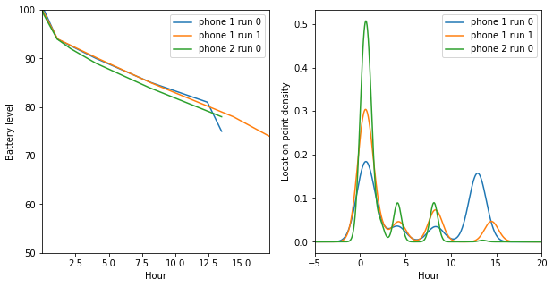
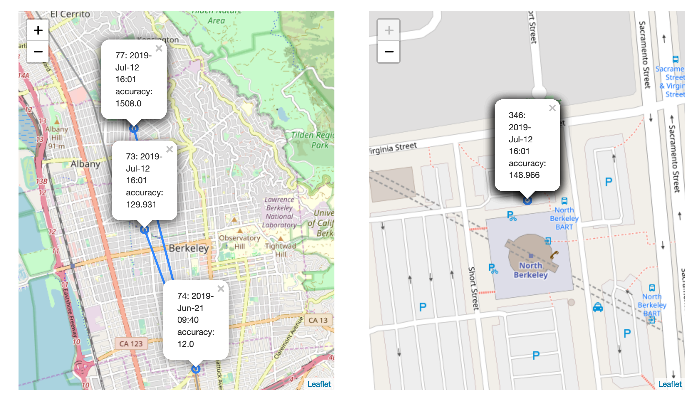
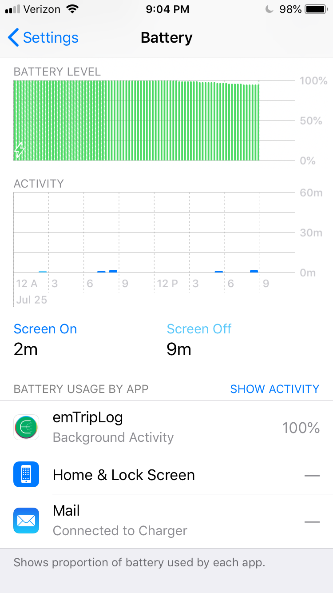
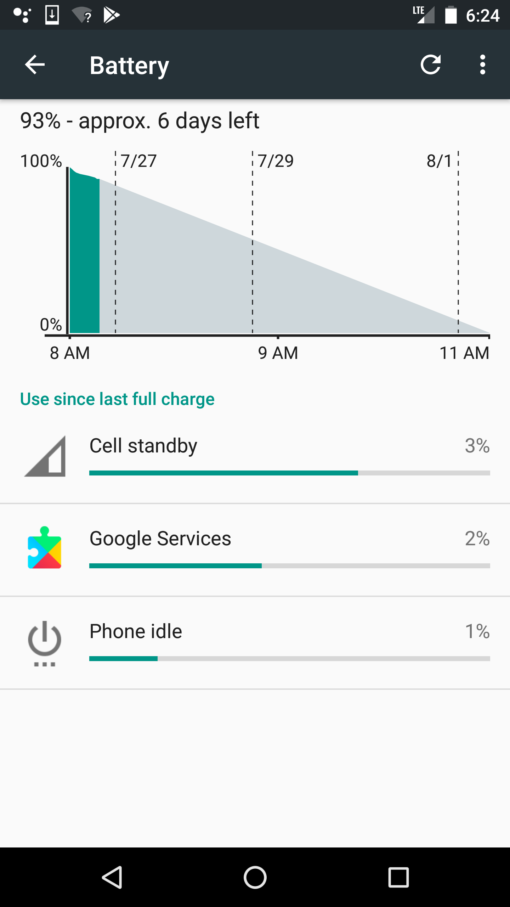
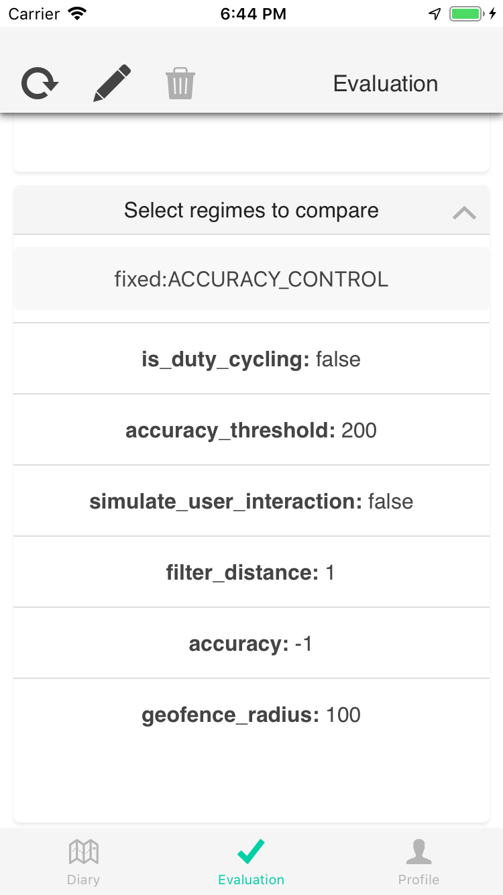
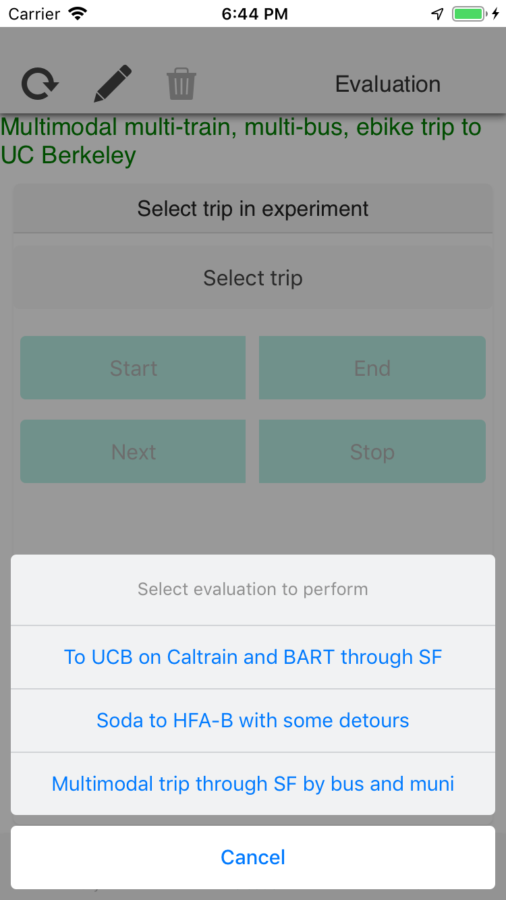
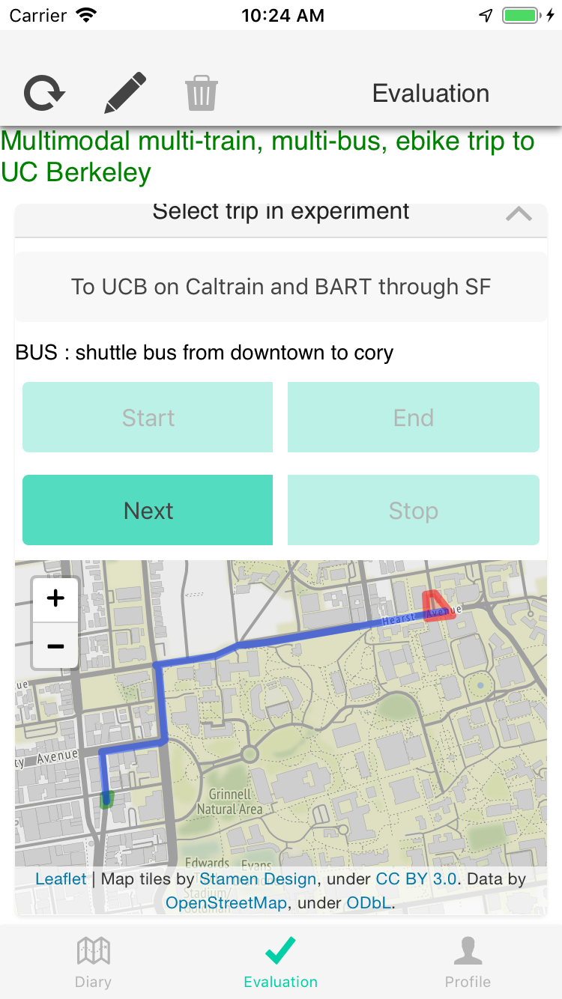
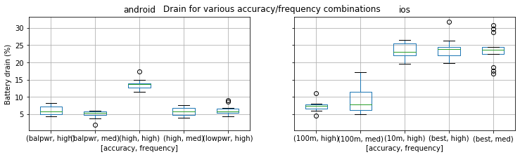
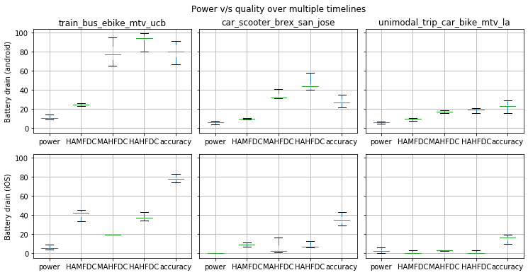
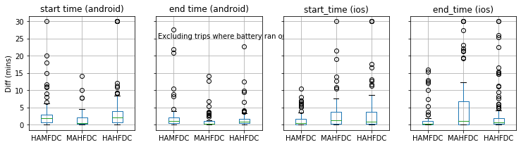

As smartphone-based Human Mobility Systems (HMSes) shift from informing individuals to influencing public asset allocation, it is critical to assess how well they perform. Evaluation techniques of HMSes have typically been ad hoc, limited to single measurements and ignored power-accuracy trade-offs. These trade-offs are important due to built-in and context-sensitive sensing in the phones - e.g., &quot;Find my iPhone&quot; or &quot;Doze mode&quot;.

Treating HMSes as physical instruments with inherent physical noise, we propose requirements related to holistic power/accuracy trade-offs, privacy preservation, and ground truth. We then outline a novel evaluation procedure that uses artificial trips and multiple parallel phones to provide controlled, repeated inputs to the HMSes under test. Artificial trips mitigate privacy concerns and allow repeatability while efficiently exploring a wide variety of trip contexts. Parallel sensing with control phones mitigates the effects of context sensitive power consumption and inherent sensing error.

Our results show the benefits of thinking statistically about HMSes. They meet the requirements and account for variations in observed behavior better than the alternatives. They control for outliers, revealing meaningful signals about the behavior of smartphone virtual sensors that are relevant to instrumenting human travel behavior. If adopted widely by the community, the resulting ground truthed, trade-off-aware, public datasets can form the basis for additional HMS optimizations.

In this dataset, we use this procedure to create three artificial timelines with 15 different modes, including ebike and escooter. We use these timelines for a comprehensive evaluation of three different sensing settings with over 500 hours of ground-truthed data.

Inspired by the popularity of smartphone-based personal fitness tracking, the transportation community aims to build Human Mobility Systems (HMSes) that can automatically track and classify multi-modal travel patterns. Such systems can replace expensive and infrequent travel surveys with long-term, largely passive data collection augmented with intermittent surveys focused on perceptual data.

While there has been much work on building HMSes, both in academia and in industry, the procedure to <em>evaluate</em> them has largely been an afterthought. Careful evaluations are critical as we move from the personal to the societal domain. Users who make decisions based on self-tracking have an intuition of its accuracy based on their experienced ground truth. The decisions are low-stakes lifestyle changes, which may be personally meaningful, but are not societally contentious. However, a Metropolitan Transportation Agency picking projects and allocating millions of dollars in funding needs to know the accuracy of the data before making its decisions .

Computational Mobility (CM) can frame approaches to evaluate accuracy. Consistent with interdisciplinary research principles, we can apply computational concepts to shift the focus from ad hoc techniques to more rigorous concepts for evaluating software systems and algorithms. These concepts include: 1. <em>artificial workloads</em>, from Operating Systems, 1. <em>standard datasets</em>, from Machine Learning, and 1. <em>handling transient effects</em>, from Networking.

The rest of this chapter is structured as follows. We start with an intuitive description of the challenges and the solution in Section [sec:procedureintuition]. Next, we outline the evaluation requirements in Section [sec:evalrequirements] and outline an experiment procedure that meets them in Section [sec:our-procedure]. We discuss some alternative approaches in Section [sec:relaxing-constraints] and describe the reference implementation in Section [sec:system-experiment-design], concluding with Section [sec:evalconclusion].

<h1 id="intuition-for-challenges-and-solution">Intuition for challenges and solution</h1>

The typical HMS evaluation procedure (e.g., Quantified Traveler, prior versions of our work) is ad hoc and also functions as a pilot — a small (() 3-12) set of the author’s friends and family are recruited to install the app component of the HMS on their phones, and go about their daily life for a few days or weeks while annotating the trips with “ground truth”. The ground truth annotation can either directly happen on the app, or through a recap at the end of the day. Conscientious researchers may ensure that the set of evaluators are demographically diverse, in an attempt to evaluate against a richer set of travel patterns.

While this procedure imposes little additional researcher burden, it conflates the <em>experimental</em> procedure (understanding human travel behavior in the wild) with the <em>evaluation</em> procedure (evaluating the instrument that will measure the human travel behavior). The first is trying to understand <em>behavior</em>, so it needs human diversity. The second is trying to understand <em>sensing</em> parameters, so it needs diversity of <em>trip types</em>. The human functions as a phone transportation mechanism during evaluation and could be profitably replaced with a self-navigating robot if one was available.

An analogy with classic physical measurements may be useful. Consider the situation in which a researcher wants to collect data on the weight distribution of the population in a particular region. Since there are currently no certifying bodies for travel diaries, let us pretend that she cannot purchase a pre-certified scale. How would she evaluate the available scales before starting her experiment?

The analog to ad hoc evaluation procedure would involve recruiting several of her friends and family to weigh themselves on the scales and compare the reported weight with their true weight. This analogy clearly reveals some limitations of the ad hoc procedure: 1. How does she trust that the self-reported weights are “true”? 1. If all her friends are adults weighing 55 kg – 75 kg, how does she know how the scales perform outside that range?

She can overcome the range limitations by recruiting a broader set of testers, e.g., through an intercept survey. However, that modification makes the ground truth limitation worse, since it is less likely that strangers will reveal their true weight. A further modification might pay contributors to improve the self-reported accuracy, but at this point, she is essentially running the experiment.

A more robust evaluation procedure would involve choosing known weights across a broad range (e.g., 0 kg to 300 kg in 10 kg increments) and comparing them to the reported weights. Since no instrument is perfect, there is likely to be some variation in the values reported. She would likely repeat the experiments multiple times in order to establish error bounds.

HMS evaluation procedures need to be more sophisticated than simple physical measurements since: 1. their operation is based on prior behavior (e.g., HMS duty cycling, android doze mode) and the potential for feedback loops makes it important to control the <em>sequence</em> of evaluation operations, 1. unlike a physical scale, which has a fixed one-time cost, they have an ongoing, variable cost in terms of battery drain, so the evaluation must assess the power/accuracy trade-off, and 1. unlike scalar weight data, HMSes generate strongly correlated timeseries data, which is extremely hard to anonymize.

Therefore, the main contributions in this chapter are:

<ol style="list-style-type: decimal">
<li>We propose an <strong>evaluation procedure</strong> for HMSes based on predefined, ground truthed, artificial trips and outline how it addresses the above challenges,</li>
<li>We describe the design of a cross-platform <strong>evaluation system</strong> that can be used to perform such evaluations reproducibly and publish the results.</li>
<li>We highlight some lessons learned during this process that future groups might want to take into account while designing their experiments.</li>
</ol>
<h1 id="requirements-for-evaluating-human-mobility-systems-hmses">Requirements for evaluating Human Mobility Systems (HMSes)</h1>

Human Mobility Systems (HMSes) need a methodology for rigorous evaluation that allows users of the data to understand their limitations and their accuracy in various settings. Before establishing such a method, we need to understand the evaluation requirements, and the challenges associated with meeting each requirement. Establishing a clear set of requirements also allows us to understand the limitations of the proposed method and provides a roadmap for future improvements.

<h2 id="holistic-evaluation-power-vs.-overall-accuracy">Holistic evaluation: power vs. overall accuracy</h2>

Using smartphones for collecting background sensed location data leads to higher battery drain. Travelers are very sensitive to battery life  , and there is a clear power/accuracy trade-off for smartphone sensing. Naïve high accuracy sensing drains the battery for almost all users (Section [sec:modeling]), but techniques to lower battery drain also lower the accuracy (Section [sec:apioverview]) So it is critical that the evaluation consider both power and accuracy together. For example, if an HMS can get 95% accuracy, but runs out of battery in 2 hours, the deployer needs to adjust the incentives offered (e.g., money, utility, …) accordingly.

<h2 id="privacy-preserving">Privacy preserving</h2>

The data collected by HMSes includes location traces, which are inherently privacy sensitive. While a common privacy technique is to <em>de-link</em> datasets by replacing Personally Identifiable Information (PII) with a code , location traces allow re-identification from the raw data alone . Intuitively, from the location traces, we can find the <em>places</em> where people spend most of their time, which allows us to discover their home and work locations and uniquely identify them. This implies that the evaluation methodology must address privacy concerns.

<h2 id="ground-truthed">Ground truthed</h2>

In order to fully evaluate the data collected, we need ground truth for not just the mode, but also the trip start and end times, section start and end times and the travel trajectory. Labeling trips through prompted recall is a low effort technique to collect mode ground truth, but it depends on accurate trip and section segmentation. Segmentation ground truth requires recalling the start and end <em>times</em> at the end of the day, which is likely to be unreliable . Similarly, for evaluating trajectories, travelers can potentially draw out spatial ground truth but spatiotemporal ground truth is almost impossible to obtain after the fact.

<h1 id="controlled-evaluation-of-context-sensitivity">Controlled Evaluation of context-sensitivity</h1>

Instruments are typically evaluated by repeatedly exposing them to controlled inputs to determine their error characteristics. In the case of complex systems such as HMSes, the evaluation needs additional controls for feedback loops, cost/accuracy trade-offs and privacy considerations. In this section, we outline em-eval — a procedure for HMS evaluation that addresses these concerns with two techniques that are novel in this domain:

<ol style="list-style-type: decimal">
<li>
predefined, <strong>artificial trips</strong> that support spatial ground truth, preserve privacy, increase the breadth of <em>trip types</em> and support repetitions for establishing error bounds, and
</li>
<li>
power and accuracy <strong>control phones</strong> carried at the same time as the experimental phones, that can cancel out context-sensitive variations in power and accuracy.
</li>
</ol>
<h2 id="artificial-timeline">Artificial timeline</h2>

The core of the experimental procedure is the predefined specification of a sequence of artificial <em>trips</em>, potentially with multiple <em>legs</em> or <em>sections</em> per trip. The trajectory and mode of travel is also predefined. The <em>data collector</em> completes the timeline trips by strictly following the specified trajectory and mode while carrying multiple phones that collect data simultaneously using different configurations.

The specified predefined trajectories provide spatial ground truth. We do not predefine temporal ground truth since it is extremely hard to control for differences in walking speeds, delays due to traffic conditions, etc. We use manual input from the data collector to collect <em>coarse</em> temporal “ground truth” of the transitions along the timeline. We do not use manual input for <em>fine-grained</em> temporal ground truth along the trajectory because:

<ol style="list-style-type: decimal">
<li>human response times are too slow for fine-grained temporal ground truth during motorized transportation, and</li>
<li>distracting the data collector during active transportation can be risky.</li>
</ol>

Using an artificial timeline addresses several of the unique challenges associated with HMS evaluation.

Privacy 
Since the trips are artificial, they preserve the data collector’s privacy. Even if his adversaries would download the trips, they would not be able to learn anything about his normal travel patterns.

Spatial ground truth 
Since even high accuracy (GPS-based) data collection has errors, predefining spatial ground truth allows us to resolve discrepancies (Section [sec:relaxing-constraints]) and compute the true accuracy.

Breadth and variety of trips 
Artificial trips allow efficient exploration of the breadth of the trip space. For example, the trips could include novel modes such as e-scooters and e-bikes, or specify different contexts for conventional modes, such as express bus versus city bus.

Repetitions 
Since the trips are predefined, they can be repeated exactly. This allows us to use standard variance and outlier detection to estimate error bounds on the measured values.

<h2 id="control-phones">Control phones</h2>

The artificial trips give us spatial ground truth, but they do not give us cost (power consumption) or temporal ground truth.

We control for the cost through the use of the use of multiple phones, carried at the same time by the data collector. The phones carried by the data collector are divided into control phones and experiment phones. The control phones represent the baseline along each of the axes in our trade-off and the experiment phones implement a custom sensing regime that is at some intermediate point. The evaluation procedure allows us to determine those points.

The power control phone captures the baseline power consumption of a phone that is not being used for tracking by a HMS. This does not mean that the phone is idle — phone OSes (e.g., iOS or android) are complex, context-sensitive systems that perform their own location tracking (e.g., “Find my iPhone”) and their own duty cycling (Figure [fig:poweraccuracyvariations]). Using a power control allows us to identify the <strong>additional power</strong> consumed by the HMS, even if it is context sensitive.

The accuracy control captures the upper bound on the accuracy of a particular class of smartphones given sensor and OS limitations. While we would like to compare the experimental accuracy to ground truth,

<ol style="list-style-type: decimal">
<li>all sensors have errors, so ground truth is not achievable in practice,</li>
<li>artificial trips give us spatial but not temporal ground truth, and</li>
<li>GIS-based trajectory specifications do not have an associated power trade-off.</li>
</ol>

Using an accuracy control allows us to compare the experimental data collection against the best achievable data collection, in addition to the ground truth.

<h1 id="discussion-of-alternative-procedures">Discussion of alternative procedures</h1>

While em-eval (Section [sec:our-procedure]) addresses the complexities of HMS evaluation, it also imposes a much higher researcher burden than the ad hoc method. This raises the question of whether all these controls are necessary or merely sufficient. In this section, we discuss some alternative approaches and highlight the unexpected behavior that they would miss. This list is not comprehensive but provides a flavor of the arguments without tedious repetition.

|:-:| || ||

<h2 id="no-artificial-trips">No artificial trips</h2>

Creating predetermined trips requires an upfront investment in effort, and requires the data collector to take trips just for data collection. An alternative would use multiple phones, but allow data collectors to go about their regular routines and tag the modes only. We could use the accuracy control phones to determine the ground truth trajectory.

No privacy 
Capturing the data collector’s regular routines compromises their privacy. Even if the data does not include their name or phone number, a list of their commonly visited places and trips can form a unique fingerprint that can uniquely identify them . This sensitivity precludes evaluation data from being published and used for reproducible research.

No repetition 
The behavior of the same phone with the same configuration can vary over time, both for power and for accuracy (Figure [fig:poweraccuracyvariations]). Repeating the same trip multiple times allows us to detect and remove outliers. With ad hoc trips, it is unclear whether any difference in behavior is real or caused by context-sensitive variation. And without predetermined trips, it is challenging to repeat the same trips and trajectories over time.

No spatial ground truth 
No sensor is perfect and even the accuracy control phones can have sensing errors. If we see a divergence between an experiment phone and the accuracy control, it is unclear which one has the error (Figure [fig:poweraccuracyvariations]).

<table>
<thead>
<tr class="header">
<th>iOS</th>
<th>android</th>
</tr>
</thead>
<tbody>
<tr class="odd">
<td></td>
<td></td>
</tr>
</tbody>
</table>
<h2 id="no-control">No control</h2>

Using control phones requires the researcher to purchase multiple phones of the same make, model and approximate age. While used smartphones are relatively cheap (USD 50 – USD 100), 4 android phones and 4 iPhones combined will still cost USD 400 – USD 800. An alternative would be to use one phone each for each OS, perform the timeline trips, and look at the app-specific power consumption reported by the phone OS.

Sensor access attribution and the meaning of the % 
Sensor access in modern phone OSes (android and iOS) is also context-sensitive, making it unclear how it is counted for per-app consumption. For example, if multiple apps request a sensor reading, the OS delays returning a result until it can batch related requests and serve all of them with a single sensor access (e.g., Figure [fig:smoothingnavigationstartexample]). This is why the OSes treat the sensing frequency as a hint instead of a guarantee. Second, if sensor access is mediated by a service (e.g., fused location in Google Play Services), it is unclear whether the sensor access is counted for the service or the app (Figure [fig:powermeasurementchallenges]). And finally, although android reports per app consumption as a % of the battery <em>capacity</em>, iOS does so as a % of the battery <em>consumption</em>. This indicates that on dedicated phones, the HMS under test will always show close to 100%, whether it is the power control or the accuracy control (Figure [fig:powermeasurementchallenges]). Using a control phone for the power will cancel out these context-sensitive effects and estimate the difference in power drain with and without the HMS app component installed.

Custom duty cycling increases power drain 
Sensing is not the only source of power consumption — CPU usage can also have a significant impact on power usage. HMSes can use smart local processing to reduce local sensing, but the increased power consumption from the CPU can cancel out the savings from the sensing. Including an accuracy control showed that, unlike in 2015 (Section [sec:apioverview]), the basic duty cycling algorithm in our experiment paid for itself in low frequency sensing but actually increased power usage for high frequency sensing (Figure [fig:powermeasurementchallenges]).

<h1 id="related-work">Related work</h1>

Human Mobility Systems (HMSes) are complex to evaluate (Section [sec:relaxing-constraints]). Other researchers have identified similar challenges as part of survey papers (e.g., phone context, privacy, learning, scaling , varying metrics and time scales across research areas ). However, to the best of our knowledge, there is no proposed solution that addresses all of them.

Papers related to instrumenting travel behavior fall into three main categories; we list some work from each as an example. A comprehensive classification of papers into categories is beyond the scope of this paper.

<h2 id="context-sensitive-sensing-algorithms-power-without-accuracy">Context sensitive sensing algorithms: power without accuracy</h2>

This research area focuses on context sensitive, adaptive power management of sensors. Papers such as ACE  and Jigsaw  compare their power requirements to naive sensing techniques. However, their accuracy evaluations focus on the localization error (Jigsaw), or comparison to naive inferred results[1] (ACE).

<h2 id="travel-diary-systems-compare-to-manual-surveys">Travel diary systems: compare to manual surveys</h2>

There is a vast variety of one-off travel diary systems that combine smartphone based sensing with cloud-based processing to generate travel diaries. Systems such as such as Data Mobile , Future Mobility Study (FMS)  and rMove  aim to replace the paper and telephone based Household Travel Surveys with smartphone and cloud based systems. So they evaluate the accuracy of their systems against the traditional methods, not against ground truth. This can show that smartphone based methods are significantly better than traditional methods, but not provide a quantitative estimate of the accuracy of their system. Similarly, they do not include quantitative power evaluations - preferring statements like “Among the three types of discrepancies, the second type, data gap due to battery drainage, was most frequently observed.”  or “The battery consumption test was simply whether, under regular usage, the phone could make it through the day without having to be charged.” . So they do not rigorously evaluate either the power or the accuracy side of the trade-off.

<h2 id="mode-inference-accuracy-without-power-non-uniform-data">Mode inference: accuracy without power, non-uniform data</h2>

Mode inference of travel mode based on sensor data is an extremely popular subject in the literature[2]. Researchers have used decision trees , Hidden Markov Models , and neural networks  to distinguish between various subsets of travel modes. However, although the inference algorithms are different, most such papers use similar methods for evaluating their accuracy. They typically recruit a small sample of their friends (e.g., 16 users over one day , 4 users over two weeks ) to collect naturalistic data along with annotations of the ground truth. The data collection focuses on the sensors used for analysis and omits the battery. This kind of evaluation does not meet the any of the requirements outlined above, except privacy, which is addressed by not publishing the dataset.

[1] e.g., based on speed

[2] Probably because it is hard, and nobody has really solved it well yet for modes other than walking

<h1 id="evaluation-system-design">Evaluation system design</h1>

The em-eval procedure (Section [sec:our-procedure]) allows us to estimate the power/accuracy trade-off of various sensing configurations used in Human Mobility Systems (HMSes). One of the novel components of the procedure involves the specification of pre-defined, artificial trips with ground-truthed trajectories and modes.

This section explores the nuances of implementing such a procedure. We first describe a publicly available reference implementation of a system – em-eval-zephyr – that can be used perform this procedure. We then discuss challenges encountered while using the system to perform an experiment in the San Francisco Bay Area (Section [sec:accuracyevaluation]). Some of these challenges were addressed by system improvements, while others are documented as best practices for future data collectors.

<table>
<thead>
<tr class="header">
<th>Control configuration</th>
<th>Trip selection</th>
<th>Map leg details</th>
</tr>
</thead>
<tbody>
<tr class="odd">
<td></td>
<td></td>
<td></td>
</tr>
</tbody>
</table>
<h2 id="system-overview">System overview</h2>

em-eval is a generic <em>procedure</em> for HMS evaluation – it does not actually collect any data. To use it, we need a concrete system that configures data collection based on the spec configurations, collects coarse temporal ground truth, periodically reads battery levels and stores data for future analysis.

We built a system – em-eval-zephyr – that combines our prior work on power evaluations  with our existing HMS platform  and supports performing the em-eval procedure. The system consists of three main parts:

Evaluation Specification 
The <em>spec</em> describes an evaluation that has been performed or will be performed in the future. In addition to mode and trajectory ground truth, it includes the app configurations to be compared and the mapping from phones to evaluation <em>roles</em>. The spec automatically configures both the data collection app and the standard analysis modules.

To reduce evaluator burden, we provide preprocessing functions to fill in trajectory information based on route waypoints for road trips and OSM relations for public transit. We also provide sample notebooks to verify timelines and their components before finalizing and uploading the evaluation spec.

Auto-configured Smartphone App 
We have generated a custom UI skin for our e-mission platform  that is focused on evaluation. It allows evaluators to select the current spec from the public datastore, and automatically downloads the potential comparisons to be evaluated, the role mappings and the timeline.

Since the e-mission platform data collection settings are configurable through the UI, the sensing configurations defined in the spec are automatically applied based on the phone role when the data collector starts an experiment. For example, when starting an experiment to compare high accuracy (HAHFDC) versus medium accuracy (MAHFDC) data collection, the second experiment phone will automatically be set to MAHFDC settings. Finally, when the data collector performs the trips, he marks the transition ground truth in the UI, and the app automatically displays the next step in the timeline (Figure [fig:em-eval-zephyr-ui]).

Public Data + Sample Access Modules 
Since there are no privacy constraints, em-eval-zephyr uploads all collected data to a public instance of the e-mission server. The associated repository contains sample notebooks that can download, visualize and evaluate the data associated with a particular spec. All the data used in this paper is publicly available, and the notebooks can be manipulated interactively using binder[1].

Note that although the em-eval <strong>procedure</strong> is general, the current implementation of the em-eval-zephyr <strong>system</strong> is integrated only with the e-mission platform. Using the procedure with other HMSes will require re-implementing the em-eval procedure with the other HMS, or using a combination of systems for the evaluation. For example, em-eval-zephyr can still read the battery level periodically, display the trip sequence to the data collector, and be used to mark the transition ground truths. However, the evaluator needs to configure the settings for the app being tested manually, and to download, clean and analyze the resulting data.

<h2 id="system-iterations-and-lessons-learned">System iterations and lessons learned</h2>

As we started collecting data, we had to resolve some ambiguities around exactly when the transition ground truth should be collected. We also discovered best practices that increased the likelihood of successful data collection. This section outlines these lessons learned.

System change: capture transition complexity 
One of the big promises of using HMSes for instrumenting human travel is that we don’t have to focus only on the primary mode. Instead, with fine-grained data collection, we can understand the full complexity of end to end travel.

In fact, the only true unimodal trips are walking trips. Everything else is multi-modal. Thus, a significant change to the system was to restore the hidden complexity that is elided from user descriptions of travel diaries. For example, consider the trip description “Drive from Mountain View Library to Los Altos Library”. Although that appears to be a unimodal trip, it is actually a multi-modal trip which involves implicit walk access sections to and from the car at the source and destination respectively.

It is not possible to predetermine the ground truth for these walk access sections since we cannot control which parking spaces are available when we perform the trip. We address such issues by adding <em>shim sections</em>, and expanding the start and end from points to () 100 m polygons. We can then relax the constraints around ground truth within the polygon by only using the reference dataset, but still check the accuracy of the mode inference (Figure [fig:em-eval-zephyr-ui]).

Best practice: Pilots are critical 
In spite of reviewing the predetermined trajectories ahead of time as part of the validation process, and also having them displayed on the em-eval-zephyr UI, we found that we frequently made small mistakes, during the first round of data collection for a new timeline. Sometimes, we found that the predefined routes, potentially suggested by Open Source Routing Machine (OSRM), felt unsafe to bicycle on. We had to tweak the specification to pick safer routes. The second repetition generally resolved these issues. In order to avoid a stressful data collection experience, we suggest running through a new timeline with a trial run before starting full-featured data collection.

Best practice: Mindfulness 
Remembering to mark the transition ground truths was one of the hardest parts of the ongoing data collection and really highlights the challenges of ground truth collection. In spite of the fact that she was performing artifical trips to collect data for her own project, one of the authors forgot to mark wait () move transitions during the pilot for the long multi-modal timeline because she had started checking her email while waiting. It is important to be present in the moment and pay attention to the context while collecting data.

[1] <a href="https://mybinder.org/" class="uri">https://mybinder.org/</a>

<h1 id="evaluation">Evaluation</h1>

|:-:| || || ||

<h2 id="experiment-design">Experiment design</h2>

em-eval is a generic evaluation procedure and can be used with any kind of HMS. em-eval-zephyr is a reference implementation of em-eval that used to evaluate many experimental settings relevant to HMSes over any set of trajectories. The evaluator can pick her settings based on her research goals. In this section, we outline our goals for this evaluation, and use them to define three timelines that cover 15 separate modes, including recently popular modes such as escooter and ebike.

Dwell time 
Instead of focusing only on trips, we wanted to evaluate a timeline that included significant dwell time. We could see from our calibration runs that android appears to have built-in duty cycling and including significant dwell time would allow us to capture the impact of this context sensitive behavior. Therefore, we structured our timeline trips as round trips to libraries with an intermediate dwell time (3 ) the mean travel time to the location.

Broad range of modes 
HMS evaluations should cover a broad spectrum of trip types, and since we are creating artificial trips, we can structure them to maximize mode variety. In order to efficiently cover this space, we tried to ensure that no mode was repeated. We only had to include commuter rail twice since there were few other transit options to reach the starting point chosen.

Multi-modal transfers 
Detecting multi-modal transfers in a HMS is tricky because there isn’t a clear signal similar to a trip end. We ensure that there are many transition examples by emphasizing multi-modal transfers.

With those goals in mind, we decided on three artificial timelines of varying lengths that cover a total of 15 separate modes. We chose each timeline to be round trips to libraries so as to not include identifiable location data (e.g., home location) in our experiments. A description of each timeline with the associated modes and dwell times is given in Table  [table:timelines-table].

Since this paper focuses on the evaluation procedure, to avoid bias, we do not use it to evaluate any particular HMS. Instead, we use it to evaluate the virtual sensors provided by smartphones themselves. These virtual sensors are exposed by smartphone operating systems (OSes) by combining underlying physical sensors using proprietary algorithms. iOS already restricts developer access to the GPS, instead supporting a virtual location sensor that chooses underlying sources based on developer-supplied accuracy constants. As phone OSes impose greater background restrictions on apps, we can only expect the use of such sensors to grow. In this section, we analyze spatial accuracy and motion activity accuracy from our collected data, and draw inferences from them to demonstrate the benefits that can be gained by using a procedure such as em-eval.

X|X|X|X|X|X id &amp; Description &amp; Outgoing trip modes &amp; Incoming trip modes &amp; Dwell time &amp; Overall time &amp; &amp; car &amp; bike &amp; 1 &amp; 3 &amp; &amp; (city streets) &amp; &amp; hrs &amp; hrs &amp; &amp; &amp; &amp; &amp; &amp; &amp; car &amp; escooter &amp; 3 &amp; 5.5 &amp; &amp; (freeway) &amp; Bus Rapid Transit &amp; hrs &amp; hrs &amp; &amp; commuter train &amp; ebike (shared) &amp; 6 &amp; 12.5 &amp; &amp; subway &amp; express bus &amp; hrs &amp; hrs &amp; &amp; city bus &amp; downtown walk &amp; &amp; &amp; &amp; &amp; light rail &amp; &amp; &amp; &amp; &amp; commuter rail &amp; &amp;

[table:timelines-table]

<h2 id="spatial-accuracy">Spatial accuracy</h2>

Box plots of the distribution of spatial error of the measured locations against the groundtruth in the different timelines are shown on the top row of Figure  [fig:spatio-temporal-plot]. It is interesting to note the skewed nature of the plots, and the presence of different outliers, whose values seem to vary across phones across timelines. Ad-hoc evaluation schemes would probably identify them by comparing error values against a threshold. Choosing this threshold without the knowledge of the distribution of error values would be difficult and introduce ambiguity to the evaluation. Our statistical and systematic approach eliminates these difficulties.

<h2 id="motion-activity-accuracy">Motion activity accuracy</h2>

The distribution of temporal error between the ground truth section transitions and sensed activity transitions is shown in the bottom row of Figure  [fig:spatio-temporal-plot]. The plot shows that despite the presence of outliers, the quality of sensing does not seem to impact any difference in accuracy. Thus, a study focusing on places and modes but not trajectories could choose a lower quality sensing configuration and reduce power drain.

|:-:| || || || ||

[fig:spatio-temporal-plot]

<h1 id="conclusion">Conclusion</h1>

Human Mobility Systems (HMSes) are complex software systems that run on equally complex smartphone operating systems (OSes). This complexity implies that there is rarely a simple linear relationship between their inputs and outputs, which complicates their evaluation.

We outline a procedure, based on repeated travel over predefined artificial <em>timelines</em> carrying experiment and control phones, to control this complexity. We show that it can control for outliers, and also reveal meaningful signals about the behavior of smartphone virtual sensors that are relevant to instrumenting human travel data.

The procedure is privacy-preserving, so it does not need human subjects approval. It focuses on <em>trip</em> diversity, not <em>demographic</em> diversity, so it can be undertaken by a small research group, or even a single researcher, as a pre-pilot before recruiting study participants. It uses predetermined trips and modes, so it can efficiently explore complex or newly emerging travel patterns and modes, such as e-scooters. The procedure, and the associated reference implementation can simplify the testing required before a study is launched.

The next stage is evaluation, which adopts this procedure to evaluate the sensing accuracy for various settings. In addition to assessing the architecture usage, we also gauge the ability of the analysis algorithms (Chapter [chap:pipelineimpldetails]) to boost the sensed accuracy.

