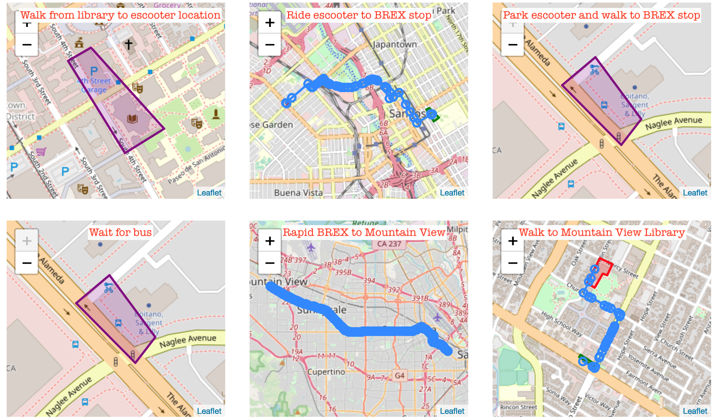

In this description, we focus on the downtown library profile.
- The profile summary is at https://github.com/MobilityNet/mobilitynet-analysis-scripts/blob/master/spec_creation/final_sfbayarea/car_scooter_brex_san_jose.json, and
- The filled profile, with the expanded trajectories, is at https://github.com/MobilityNet/mobilitynet-analysis-scripts/blob/master/spec_creation/final_sfbayarea_filled/car_scooter_brex_san_jose.filled.json

A visual representation of the return trip of this timeline shown below.
The blue lines represent the ground truth trajectory, and the purple polygons represent transition areas where we can't determine the ground truth a priori and have to use the reference spatio-temporal trajectories instead.

The other timelines are in the same directory:
- https://github.com/MobilityNet/mobilitynet-analysis-scripts/tree/master/spec_creation/final_sfbayarea
and
- https://github.com/MobilityNet/mobilitynet-analysis-scripts/tree/master/spec_creation/final_sfbayarea_filled

You can generate visualizations for them by using the validation notebook
https://github.com/MobilityNet/mobilitynet-analysis-scripts/blob/master/spec_creation/Validate_spec_before_upload.ipynb

Since the raw data contains multiple data streams, we store it as JSON instead of csv by default. Each JSON object is tagged with a key that represents the stream that it is part of.
The data models for the keys are at https://github.com/e-mission/e-mission-server/tree/master/emission/core/wrapper
Some of the keys - e.g. `stats/server_api_time` - are not relevant to this analysis since they are used for instrumenting the performance of the system.

We have uploaded separate JSON files for android and iOS for the following sensing regimes:
- the accuracy control ([android](samples/android_accuracy_control.json), [ios](samples/ios_accuracy_control.json)),
- the first experiment setting: high accuracy, high frequency, duty cycled = HAHFDC ([android](samples/android_hahfdc.json), [ios](samples/ios_hahfdc.json))
- the second experiment setting: duty cycled ([android, high accuracy, medium frequency](samples/android_hamfdc.json), [ios, medium accuracy, high frequency](samples/ios_mahfdc.json))
- the power control, which has only battery data ([android](samples/android_power_control.json), [ios](samples/ios_power_control.json))

All these are collected during the same evaluation, from `2019-07-23T08:46:22-07:00` to `2019-07-23T14:31:45-07:00`.
The iOS accuracy control has the ground truth temporal transitions (with key `manual/evaluation_transition`) included in the data.
Since this is the raw data, it does not include inferred trips or sections.

The rest of this data is stored on a public server, currently
http://cardshark.cs.berkeley.edu. Scripts to download and pre-process the data,
and to compute the metrics, are in the companion repository https://github.com/MobilityNet/mobilitynet-analysis-scripts

The scripts are launchable via binder https://mybinder.org/ for easy browsing.
All contributions are welcome! This includes both issues for clarifications and
pull requests for improvements.
